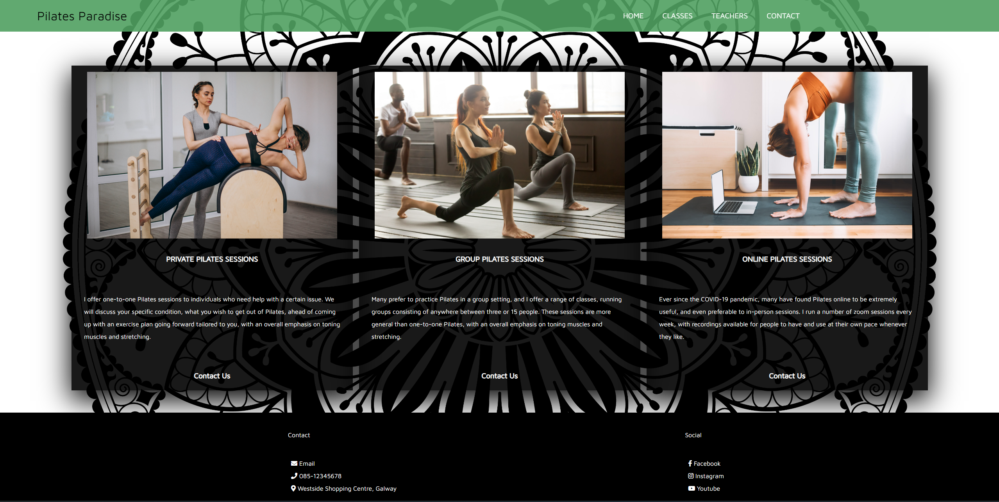
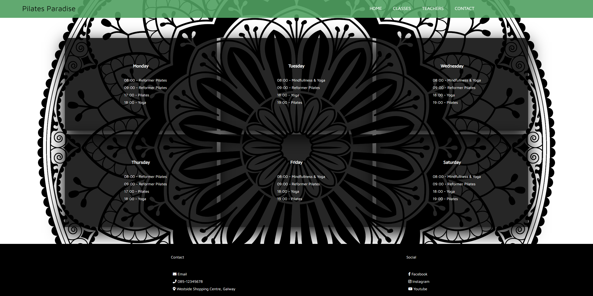
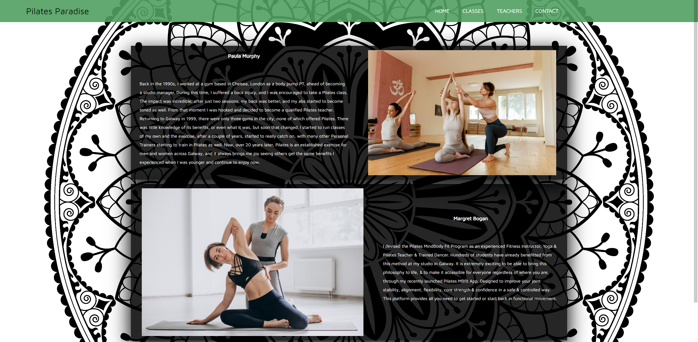
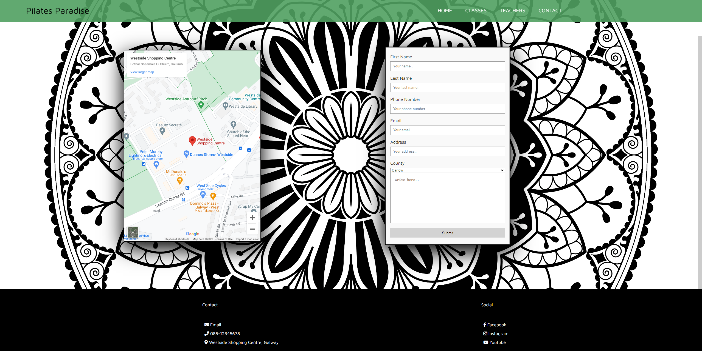
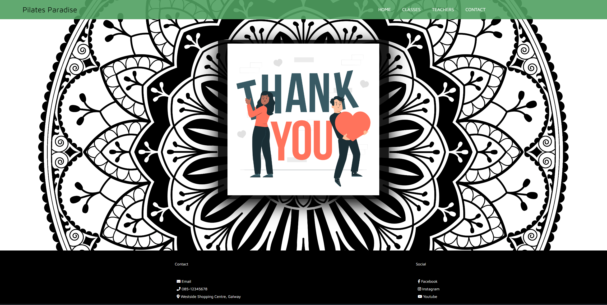
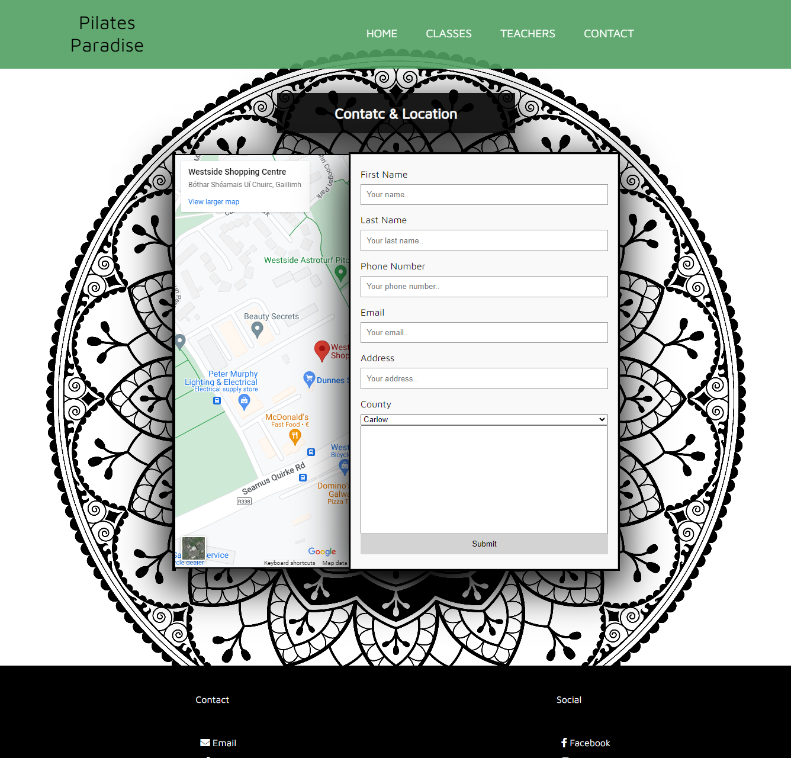
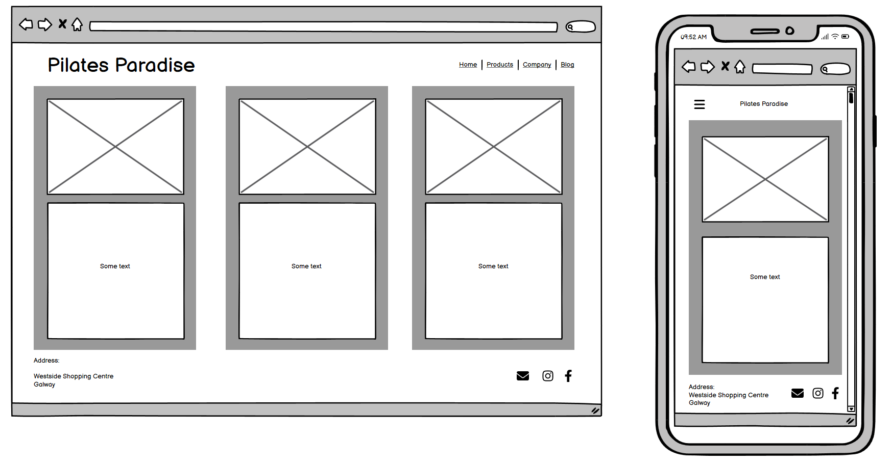
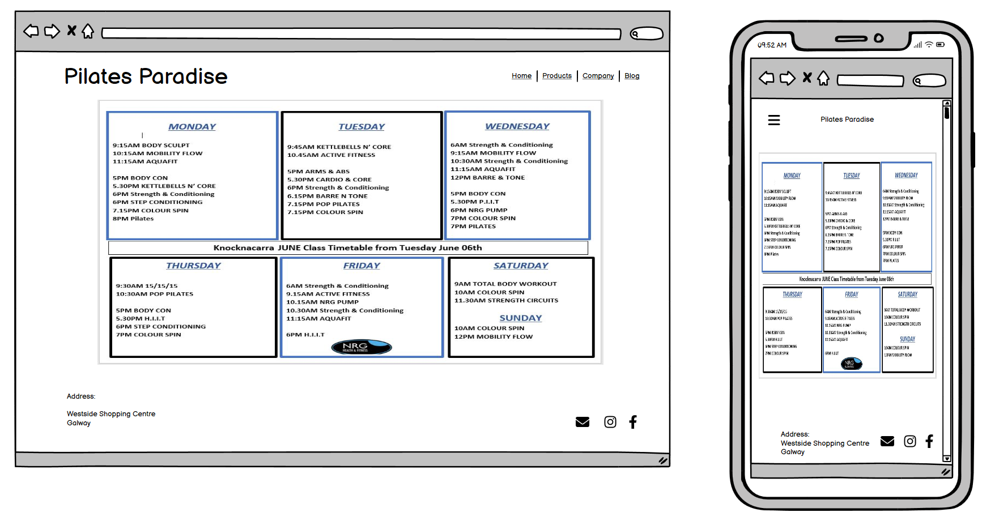
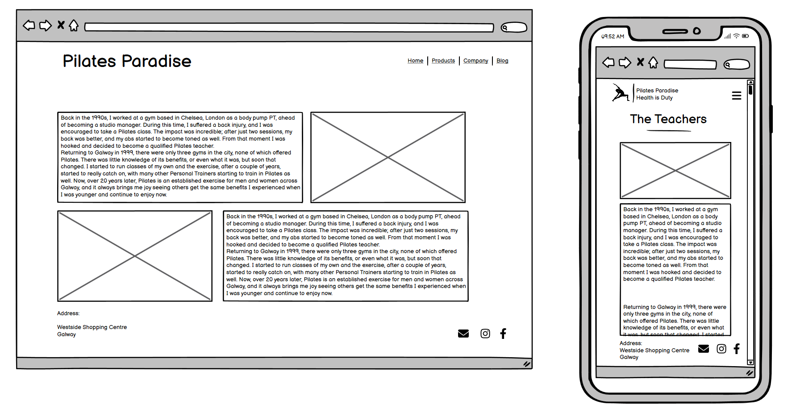
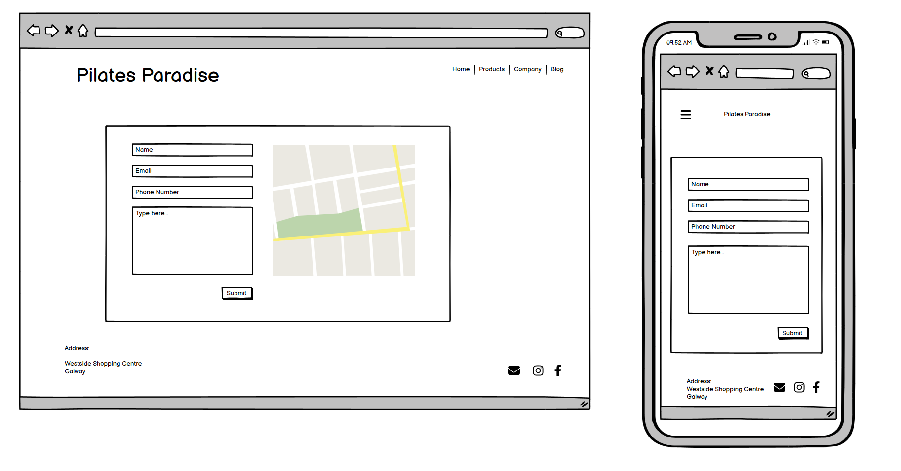

# Pilates Paradise

[View Deployed Site Here](https://ajfriel86.github.io/PilatesParadise/)

## About

The goal of delivering this site is to fullfil an end-user's needs when searching for a Pilates studio in their area. The site comprises of information regarding various classes and when they are on, as well as teacher information who guide the classes.

---

## User stories:
1. As a site user, I would like the site in English

1. As a site user, I would like to improve my well-being.

1. As a site user, I would like I am open-minded and willing to try new things.

1. As a site user, I am interested in the field of yoga and meditation.

1. As a site user, I have disposable income which I can invest in myself and my wellbeing.

1. As a site user, I would like the information to be clear so I have a better understanding of what the company does

1. As a site user, I would like to know the class schedule so I know what is days/times certain things are on

1. As a site user, I would like to be able to contact the company owner to enquire about classes

1. As a site user, I would like to know where the company is so I know where to go for the classes

1. As a site user, I would like to know about the company owner/teachers so I know their level of experience and expertise

1. As a site user, I would like to know what services are available so I know what is on offer

### Site-OWner:

1. As a site owner, I would like the site to display all the necessary information for site users to understand what service we deliver 

1. As a site owner, I would like the site to be designed tastefully and modern so it stands out from other sites

1. As a site owner, I would like classes and times to be displayed for site users to know what we do and when it is on

1. As a site owner, I would like a contact form for site users to book classes and/or contact me

1. As a site owner, I would like users to feel comfortable using the site so they can navigate easily and have all their needs met
---

## Features

1. Landing page

   - Upon visiting the site the initial page will display 3 cards with various options of different classes that are available

    

1. Classes Page

    - The following page has a timetable laid out for the various classes and when they are on

    

1. Teachers Page

    - This page will display information regarding the teachers who guide the classes at the studio

    	

1. Contact Page

    - This page will display a map with the location of the studio as well as a contact form so end users can reach out to the studio about any queries or if they wish to book a class

    

1. Thank You Page

    - This page is displayed after the form has been filled in, validated, and submitted

    
---

## Technologies used

- ### Languages:

    + [HTML](https://developer.mozilla.org/en-US/docs/Web/HTML): The markup language used to create the website.
    + [CSS](https://developer.mozilla.org/en-US/docs/Web/css): The styling language used to style the website.

- ### Other tools:

    + [GitHub](https://github.com/): This was used to host the source code of the website.
    + [VSCode](https://code.visualstudio.com/): This was the IDE used to develop the website.
    + [Chrome DevTools](https://developer.chrome.com/docs/devtools/open/): This was used to debug the website.
    + [Font Awesome](https://fontawesome.com/): This was used to create the icons used in the website.
    + [Google Fonts](https://fonts.google.com/): This was used to import the font 'Maven Pro' that is used throughout the site.
    + [Abobe Color-Wheel](https://color.adobe.com/create/color-wheel): This was used to create color swatches.
    + [W3C Validator](https://validator.w3.org/): This was used to validate HTML5 code for the website.
    + [W3C CSS validator](https://jigsaw.w3.org/css-validator/): This is used to validate CSS code for the website.
  

---
## Design

The design for this site was inspired by my local [Pilates Studio](https://galwaypilates.com/) as well as some searching on color design. I used the [Abobe Color Wheel](https://color.adobe.com/create/color-wheel) and chose a base color to work off then went with monochromatic coloring.
    

## Testing

While testing the site there were some errors and issues. One of these issues was two of the flexboxes on the contact page overlapping when resizing the screen:

This took some time to debug but after comparing the different containers from other pages I realized I had position: absolute set to the iframe of the google maps. After removing this and setting some media queries, the issue was resolved. 

Another issue was with the layout of the teachers.html page. As for the cards on this page, I wanted them to be in columns and not rows. As the other pages were in rows, there were some conflicting issues. So this was debugged using Chromes Devc Tools. After setting the background color of the image and text sections to different colors, it made it easier to visualize and debug. 

Once I was able to visualize the issue and then work within Chrome's Dev Tools, it made it easy to rework the cards so they are viewed horizontally.

### Validation

Once Testing was compelted I moved on to validating my

---

## Deployment

This website was constructed in GitPod and deployed on GitHub. The steps taken to deploy this website from its [GitHub Repository](https://github.com/Ajfriel86/PilatesParadise) are as follows:

- Log into GitHub
- Go to the list of repositories on the left-hand side of the screen.
- Click on the repository - Ajfriel86/pilatesparadise
- Choose the settings tab from the menu items across the top of the page; it is the ninth choice and last option on the menu items.
- Once the settings page has loaded scroll down to GitHub Pages.
- In the source section, choose the master branch.
- On selecting this the page is automatically refreshed and the website is deployed.
- A link to the website is then displayed, this is the deployed website address.

---

## Credits

The inspiration for this website comes from the [Galway Pilates Studio](https://galwaypilates.com/), as well as some of the contents displayed on this website where it was also sourced. 

For a deeper understanding of hamburger menus with no JavaScript, meta tags, information tags and more knowledge regarding HTML and CSS documents I used the following recourses:

  -  [W3 Schools - HTML Elemnts](https://www.w3schools.com/html/html_elements.asp)
   - [W3 Schools - Doctype](https://www.w3schools.com/tags/tag_doctype.asp)
   - [Geeks for Geeks - http-equivx-ua](https://www.geeksforgeeks.org/what-does-meta-http-equivx-ua-compatible-contentieedge-do/)
   - [HubSpot - utf-8](https://blog.hubspot.com/website/what-is-utf-8)
   - [Mozilla Viewport Meta Tag](https://developer.mozilla.org/en-US/docs/Web/HTML/Viewport_meta_tag)
   - [W3 Schools - Meta Tags](https://w3schools.com/tags/tag_meta.asp) 
   - [Ahrefs - Keywords](https://ahrefs.com/blog/meta-keywords/)
   - [Kevin Powell - Create a Responsive Nav Bar with no JS](https://www.youtube.com/watch?v=8QKOaTYvYUA&t=26s)
   - [Mozilla - Header](https://developer.mozilla.org/en-US/docs/Web/HTML/Element/header)
   - [Mozilla - Nav tag](https://developer.mozilla.org/en-US/docs/Web/HTML/Element/nav)
   - [Mozzila - HTML Markup](https://www.w3.org/TR/2012/WD-html-markup-20120329/ul.html)
   - [W3 Schools - Anchor Tags](https://www.w3schools.com/tags/tag_a.asp)

---
## Wireframes

### Home page:

### Classes page:

### Teachers page:

### Contact page:

