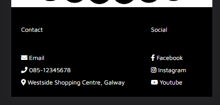

# Pilates Paradise

[View Deployed Site Here](https://ajfriel86.github.io/PilatesParadise/)

## About

The goal of delivering this site is to fulfill an end user's needs when searching for a Pilates studio in their area. The site contains information regarding various classes and when they are on, as well as teacher information who guides the classes.

---

## User stories:
1. As a site user, I would like the site in English, so it is understandable to me

1. As a site user, I would like to improve my well-being & fitness, so I feel better about myself

1. As a site user, I am open-minded and willing to try new things, to help with my emotional health 

1. As a site user, I am interested in the field of Pilates and meditation, to help prevent or ease an injury

1. As a site user, I have disposable income, which I can invest in myself and my well-being.

1. As a site user, I would like the information to be clear, so I have a better understanding of what the company does

1. As a site user, I would like to know the class schedule, so I know what is days/times certain things are on

1. As a site user, I would like to be able to contact the company owner, to enquire about classes

1. As a site user, I would like to know where the company is, so I know where to go for the classes

1. As a site user, I would like to know about the company owner/teachers, so I know their level of experience and expertise

1. As a site user, I would like to know what services are available, so I know what is on offer

### Site-OWner:

1. As a site owner, I would like the site to display all the necessary information for site users to understand what service we deliver 

1. As a site owner, I would like the site to be designed tastefully and modern so it stands out from other sites

1. As a site owner, I would like classes and times to be displayed for site users to know what we do and when it is on

1. As a site owner, I would like a contact form for site users to book classes and/or contact me

1. As a site owner, I would like users to feel comfortable using the site so they can navigate easily and have all their needs met
---

## Features

1. Landing page

   - Upon visiting the site the initial page will display 3 cards with various options of different classes that are available

    

1. Classes Page

    - The following page has a timetable laid out for the various classes and when they are on

    

1. Teachers Page

    - This page will display information regarding the teachers who guide the classes at the studio

    	

1. Contact Page

    - This page will display a map with the location of the studio as well as a contact form so end users can reach out to the studio about any queries or if they wish to book a class

    

1. Thank You Page

    - This page is displayed after the form has been filled in, validated, and submitted

    
---

## Technologies used

- ### Languages:

    + [HTML](https://developer.mozilla.org/en-US/docs/Web/HTML): The markup language used to create the website
    + [CSS](https://developer.mozilla.org/en-US/docs/Web/css): The styling language used to style the website

- ### Other tools:

    + [GitHub](https://github.com/): This was used to host the source code of the website
    + [GitHub Pages](https://github.com/Ajfriel86/PilatesParadise/settings/pages): This was used to publish the files that were pushed to the repository
    + [VSCode](https://code.visualstudio.com/): This was the IDE used to develop the website
    + [Chrome DevTools](https://developer.chrome.com/docs/devtools/open/): This was used to debug the website
    + [Font Awesome](https://fontawesome.com/): This was used to create the icons used in the website
    + [Google Fonts](https://fonts.google.com/): This was used to import the font 'Maven Pro' that is used throughout the site
    + [Abobe Color-Wheel](https://color.adobe.com/create/color-wheel): This was used to create color swatches
    + [W3C Validator](https://validator.w3.org/): This was used to validate HTML5 code for the website
    + [W3C CSS validator](https://jigsaw.w3.org/css-validator/): This is used to validate CSS code for the website
    + [Responsive Viewer](https://chrome.google.com/webstore/detail/responsive-viewer/inmopeiepgfljkpkidclfgbgbmfcennb): This was used to check the responsive design of the site on various devices
  

---
## Design

### Wireframes

#### Landing page:

#### Classes page:

#### Teachers page:

#### Contact page:

### Implementation of Design

- The design for this site was inspired by my local [Pilates Studio](https://galwaypilates.com/) as well as some searching on color design. I used the [Abobe Color Wheel](https://color.adobe.com/create/color-wheel) and chose a base color to work off then went with monochromatic coloring.
    

- I started with having the cards on every page with the background color set to black but, after some consideration and using the color swatch, I decided to make some changes. The changes made, I believe, add to the look and feel of the site. The images below are of the older version of the site:

#### Landing page:

#### Classes page:

#### Teachers page:

#### Thank You page:

### Responsive Design

- The index.html, the Landing page, as it is viewed from a mobile device: 

- The teachers.html page as viewed from a mobile device:

- The contact.html page as viewed on a tablet: 

- This was also tested on Microsoft's Edge Browser to ensure all elements carried over to other browsers and that it was responsive on this as well:

- The Chrome extension [Responsive Viewer](https://chrome.google.com/webstore/detail/responsive-viewer/inmopeiepgfljkpkidclfgbgbmfcennb) was also used to check various devices and how the site responds to these dimensions:

## Testing

### Bugs

- While testing the site there were some errors and issues. One of these issues was two of the flexboxes on the contact page overlapping when resizing the screen:

- This took some time to debug but after comparing the different containers from other pages I realized I had position: absolute set to the iframe of the google maps. After removing this and setting some media queries, the issue was resolved. 

- Another issue was with the layout of the teachers.html page. As for the cards on this page, I wanted them to be in columns and not rows. As the other pages were in rows, there were some conflicting issues. So this was debugged using Chromes Devc Tools. After setting the background color of the image and text sections to different colors, it made it easier to visualize and debug. 

- Once I was able to visualize the issue and then work within Chrome's Dev Tools, it made it easy to rework the cards so they are viewed horizontally.

- After initial testing, I then used Chrome's Dev Tools to check the performance and accessibility of the site and on all of its pages. This was done using the Lighthouse function with Dev Tools. 

- When testing the site out on various screen sizes I noticed the footer was having some issues:

- This was resolved by adding some media queries to reduce the font size:

### Performance

My first Lighthouse report gave me a performance of 75%, accessibility of 92% and 100% for Best practices and SEO.

- I then tried to convert some of the images from jpg to 'webp' But this lowered my performance from 75% to 45%. The reason for this could be that I used an online converter, rather than using 'cwebp' command-line tool or the Imagemin WebP plugin.

- As a result, I changed the images back to .jpg but I did convert the background image to a .png file type and this helped with the performance. 

### HTML Validation

Once Testing was completed I moved on to validating my site using the [W3C Validator](https://validator.w3.org/). 

- My first validation gave me the following warning:

- As it is best practice to give section tags headings I removed this warning by wrapping my sections in an outer div. 

- The classes page also had the same warning that was removed in the same way:

- The teacher's page also had the same warning that was removed in the same way:

- The contact page had some errors:

- These were corrected. The error for the stray select tag was happening as I had my text area inside my select tags. Once this was removed and placed outside the select tag, the error was resolved.

- After validating my HTML I then went on to validate my CSS. There was one error found. This was resolved by replacing the HEX value with an rbga value:

- Also, as I was using variables in my CSS, I had the following warnings:

---

## Deployment

### Deployment to Git Hub Pages

This website was constructed in VS Code and deployed on GitHub. The steps taken to deploy this website from its [GitHub Repository](https://github.com/Ajfriel86/PilatesParadise) are as follows:

- Log into GitHub
- Go to the list of repositories on the left-hand side of the screen.
- Click on the repository - [PillatesParadise](https://ajfriel86.github.io/pilatesparadise)
- Choose the settings tab from the menu items across the top of the page; it is the ninth choice and last option on the menu items.
- Once the settings page has loaded scroll down to Pages.
- In the source section, choose the master branch.
- On selecting this the page is automatically refreshed and the website is deployed.
- A link to the website is then displayed, this is the deployed website address.

### How To Clone a GitHub Repository

- On GitHub.com, navigate to the main page of the repository.
- Above the list of files, click <>  Code.
- Copy the URL for the repository.
- Open Git Bash.
- Change the current working directory to the location where you want the cloned directory.
- Type git clone, and then paste the URL you copied earlier.
- Press Enter to create your local clone.

These steps can be found in the help documentation for GitHub here:
- [Cloning a repository](https://docs.github.com/en/repositories/creating-and-managing-repositories/cloning-a-repository)

---

## Credits

The inspiration for this website comes from the [Galway Pilates Studio](https://galwaypilates.com/), as well as some of the contents displayed on this website where it was also sourced. 

For a deeper understanding of hamburger menus with no JavaScript, meta tags, information tags and more knowledge regarding HTML and CSS documents I used the following recourses:

   - [W3 Schools - HTML Elements](https://www.w3schools.com/html/html_elements.asp): This was used to understand the html tag is for
   - [W3 Schools - Doctype](https://www.w3schools.com/tags/tag_doctype.asp): This was used to understand what the Doctype tag is for
   - [Geeks for Geeks - http-equivx-ua](https://www.geeksforgeeks.org/what-does-meta-http-equivx-ua-compatible-contentieedge-do/): This was used to understand the porperty http-equivx-ua-compatible
   - [HubSpot - utf-8](https://blog.hubspot.com/website/what-is-utf-8): THis was used to understand what utf-8 is
   - [Mozilla Viewport Meta Tag](https://developer.mozilla.org/en-US/docs/Web/HTML/Viewport_meta_tag): This was used to understand the Viewport in better detail
   - [W3 Schools - Meta Tags](https://w3schools.com/tags/tag_meta.asp): This was used to understand the meta tags in greater details 
   - [Ahrefs - Keywords](https://ahrefs.com/blog/meta-keywords/): This was used to understand keywords and SEO 
   - [Kevin Powell](https://www.youtube.com/watch?v=8QKOaTYvYUA&t=26s): This was used to create a responsive nav nar with no JS
   - [Mozilla - Header](https://developer.mozilla.org/en-US/docs/Web/HTML/Element/header): This was used to understand headers in more detail
   - [Mozilla - Nav tag](https://developer.mozilla.org/en-US/docs/Web/HTML/Element/nav): This was used to understand nav tags in more detail
   - [Mozzila - HTML Markup](https://www.w3.org/TR/2012/WD-html-markup-20120329/ul.html): This was used to understand HTML markup in more detail
   - [W3 Schools - Anchor Tags](https://www.w3schools.com/tags/tag_a.asp): THis was used to understand anchor tags in more detail

---
